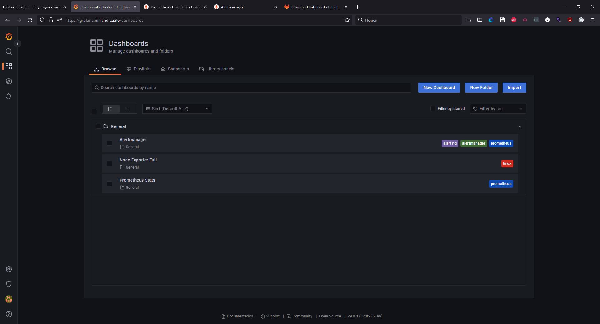
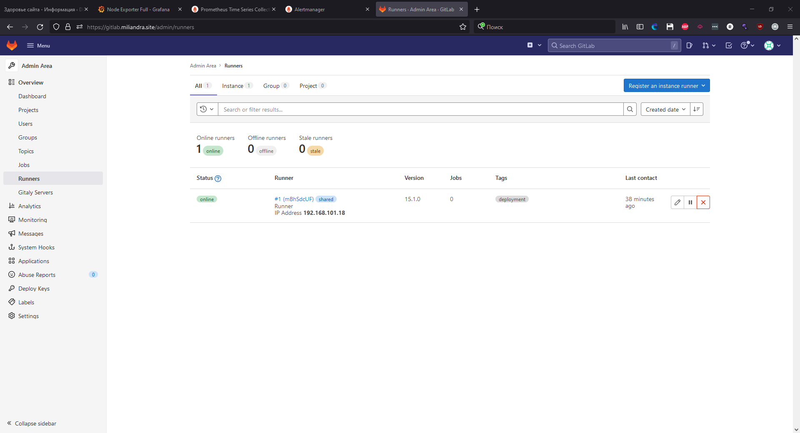

# Дипломный практикум в YandexCloud
  * [Этапы выполнения:](#этапы-выполнения)
      * [Регистрация доменного имени](#регистрация-доменного-имени)
      * [Создание инфраструктуры](#создание-инфраструктуры)
          * [Основные скриншоты](#основные-скриншоты)
          * [Стек мониторинга нашей системы](#стек-мониторинга-нашей-системы)
          * [Gitlab и Runner](#gitlab-и-runner)
          * [Реализация CI/CD](#реализация-cicd)

# Этапы выполнения:

## Регистрация доменного имени

1. Был зарегистрирован домен `miliandra.site` на [reg.ru](https://reg.ru)
2. Проверка на `whois` [Информация](https://www.reg.ru/whois/miliandra.site)

## Создание инфраструктуры

1. Был выбран альтернативный вариант(В нашем случае и ситуации - единственный): `S3 bucket` в  YC аккаунте.
2. Настроили `workspaces`. Воспользовались альтернативным вариантом и используем один `workspace`, назвав его *stage*.\

4. Домен был делегирован под управление `ns1.yandexcloud.net` и `ns2.yandexcloud.net`.
5. Вся конфигурация инфраструктуры с комментариями находится в папке [terraform](terraform/).
6. Все Ansible роли находятся в папке [ansible](ansible/).
___

## Основные скриншоты
 - **Успешно выполненный terraform**
 
 - **Основная инфраструктура после создания**
 
 - **VPC с подсетями в разных зонах доступности**
 
 - **DNS Записи**
 
 - **Основной сайт, после выполнения роли `wordpress`**
 
 - **Настроенная репликация `mysql`**
 

### Стек мониторинга нашей системы

 - **Prometheus**
 
  - **Специально перезагрузили БД**
 
  - **Ноды в Prometheus**
 
 - **Alertmanager**
 
 
 - **Grafana**
 
 - **Dashboards Node Exporter**
 

### Gitlab и Runner

 - **Gitlab и Gitlab Runner**
 
 

## Реализация CI/CD

Дипломный практикум про реализацию CI/CD находится [тут](gitlab-ci-cd/)
