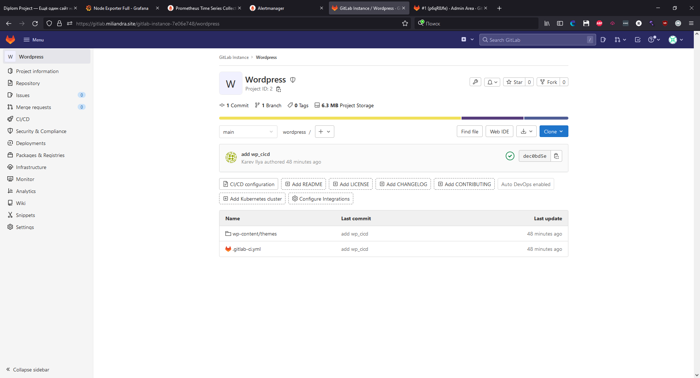
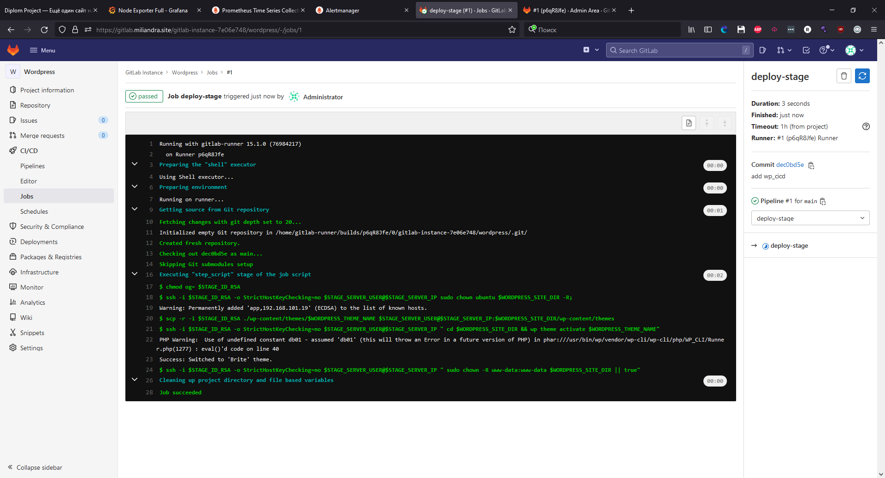

# CI/CD для деплоя темы в Wordpress

## Предварительная подготовка
1. Создадим на целевом сервере ssh ключи для пользователя `ubuntu`.
2. Открытый ключ перенаправим в `~/.ssh/authorized_keys` для дальнейшего подключения.
3. Закрытый ключ нам понадобится для добавления в `Gitlab`.
## Настройка переменных GitLab CI/CD
В разделе `GitLab Project > Settings > CI/CD > Variables` создаем следующие переменные:
 - `STAGE_SERVER_IP` – содержит IP-адрес целевого сервера. Этот IP-адрес используется GitLab Runner для установления SSH-подключения к целевому серверу.
 - `STAGE_SERVER_USER` — содержит пользователя, используемого при открытии сеанса SSH.
 - `STAGE_ID_RSA` – содержит закрытый ключ SSH, используемый во время сеанса SSH.\
 
## Подготовка GitLab к автоматическому развертыванию
1. Создаем новый публичный репозиторий для нашего проекта.
2. Загружаем в него наш файл `.gitlab-ci.yml` и папку с темой `wp-content`.\

3. При необходимости меняем значение `WORDPRESS_THEME_NAME` в файле `.gitlab-ci.yml` на название той темы, которую хотим поставить.
3. Подготавливаем `Runner` для работы с нашем проектом.

После завершения настройки, GitLab CI/CD автоматически развернет новую тему для WordPress.\
 - Успешно выполненный `pipeline`

 - Измененная тема на нашем сайте Wordpress.

Все действия при выполнении CI/CD, описаны в комментариях в файле `.gitlab-ci.yml`.
